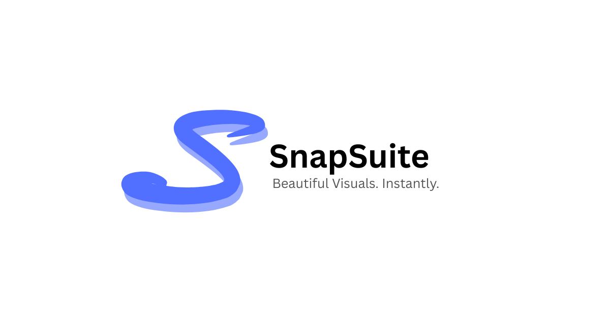

# SnapSuite 🎨

> Turn content into beautiful visuals, instantly.

SnapSuite is an open-source web application that transforms your tweets, code snippets, and quotes into stunning, shareable graphics. Built with modern web technologies, it provides an intuitive interface for creating professional visual content without any design skills required.



## ✨ Features

### 🐦 Tweet to Image

- Convert your tweets into eye-catching images
- Customizable profile information
- Multiple aspect ratios (4:5, 1:1, 16:9, 3:2)
- Background customization (solid colors, gradients, images)
- Font selection and text styling

### 💻 Code Snippet Generator

- Syntax highlighting for 20+ programming languages
- Multiple editor themes (VS Code, GitHub, etc.)
- Window styling options (macOS, Windows, minimal)
- Custom background and text colors
- Line numbers and window controls

### 💬 Quote Maker

- Beautiful quote layouts with typography
- Author attribution and role display
- Multiple font families (Inter, Roboto, Open Sans, etc.)
- Background image support with opacity controls
- Professional watermark options

### 🎨 Design Features

- **Multiple Aspect Ratios**: 4:5, 1:1, 16:9, 3:2
- **Background Options**: Solid colors, gradients, custom images
- **Typography**: 6+ Google Fonts with size controls
- **Color Customization**: Full color picker for text and backgrounds
- **Image Export**: High-quality PNG downloads
- **Responsive Design**: Works on desktop and mobile

## 🚀 Tech Stack

- **Framework**: [Next.js 15](https://nextjs.org/) with App Router
- **Language**: [TypeScript](https://www.typescriptlang.org/)
- **Styling**: [Tailwind CSS](https://tailwindcss.com/)
- **Fonts**: [Google Fonts](https://fonts.google.com/)
- **Syntax Highlighting**: [Highlight.js](https://highlightjs.org/)
- **Image Processing**: HTML5 Canvas API
- **Deployment**: Ready for Vercel, Netlify, or any static hosting

## 📦 Installation

### Prerequisites

- Node.js 18+
- npm or yarn

### Setup Instructions

1. **Clone the repository**

   ```bash
   git clone https://github.com/dnlmkhlv/snapsuite-app.git
   cd snapsuite-app
   ```

2. **Install dependencies**

   ```bash
   npm install
   # or
   yarn install
   ```

3. **Run the development server**

   ```bash
   npm run dev
   # or
   yarn dev
   ```

4. **Open your browser**
   Navigate to [http://localhost:3000](http://localhost:3000)

## 🎯 Usage

### Creating Tweet Images

1. Navigate to the Tweet Images section
2. Enter your tweet content
3. Customize your profile information
4. Choose your preferred aspect ratio
5. Style with colors, fonts, and backgrounds
6. Download your image

### Generating Code Snippets

1. Go to the Code Snippets section
2. Paste your code in the editor
3. Select your programming language
4. Choose a theme and window style
5. Customize colors and styling
6. Export your snippet

### Making Quote Graphics

1. Visit the Quotes section
2. Enter your quote and author information
3. Select font family and size
4. Choose background type (solid, gradient, or image)
5. Adjust opacity and styling
6. Download your quote image

## 🛠️ Development

### Project Structure

```
src/
├── app/
│   ├── components/          # React components
│   │   ├── code-editor/     # Code snippet editor
│   │   ├── quote-editor/    # Quote editor
│   │   ├── tweet-editor/    # Tweet editor
│   │   └── ui/             # Reusable UI components
│   ├── constants/          # App constants and defaults
│   ├── hooks/              # Custom React hooks
│   ├── types/              # TypeScript type definitions
│   ├── utils/              # Utility functions
│   └── globals.css         # Global styles
├── public/                 # Static assets
└── README.md              # This file
```

### Available Scripts

- `npm run dev` - Start development server
- `npm run build` - Build for production
- `npm run start` - Start production server
- `npm run lint` - Run ESLint
- `npm run type-check` - Run TypeScript checks

## 🤝 Contributing

We welcome contributions! Here's how you can help:

### Getting Started

1. Fork the repository
2. Create a feature branch: `git checkout -b feature/amazing-feature`
3. Make your changes
4. Commit your changes: `git commit -m 'Add amazing feature'`
5. Push to the branch: `git push origin feature/amazing-feature`
6. Open a Pull Request

### Development Guidelines

- Follow the existing code style and conventions
- Add TypeScript types for new features
- Include proper error handling
- Test your changes thoroughly
- Update documentation if needed

### Areas for Contribution

- 🎨 New design templates and themes
- 🔧 Performance optimizations
- 🐛 Bug fixes and improvements
- 📱 Mobile experience enhancements
- 🌐 Internationalization (i18n)
- 🧪 Unit and integration tests
- 📚 Documentation improvements

## 📄 License

This project is licensed under the MIT License - see the [LICENSE](LICENSE) file for details.

## 🙏 Acknowledgments

- [Next.js](https://nextjs.org/) for the amazing React framework
- [Tailwind CSS](https://tailwindcss.com/) for the utility-first CSS framework
- [Highlight.js](https://highlightjs.org/) for syntax highlighting
- [Google Fonts](https://fonts.google.com/) for beautiful typography
- All contributors who help improve SnapSuite

## 📞 Support

- **Issues**: [GitHub Issues](https://github.com/dnlmkhlv/snapsuite-app/issues)
- **Discussions**: [GitHub Discussions](https://github.com/dnlmkhlv/snapsuite-app/discussions)
- **Email**: [mikhailoff.daniil@gmail.com](mailto:mikhailoff.daniil@gmail.com)

## 🌟 Star History

If you find SnapSuite useful, please consider giving it a ⭐ on GitHub!

---

**Made with ❤️ by [Daniil Mikhailov](https://www.daniilmikhailov.com)**
